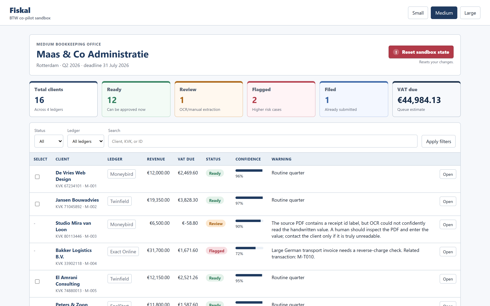
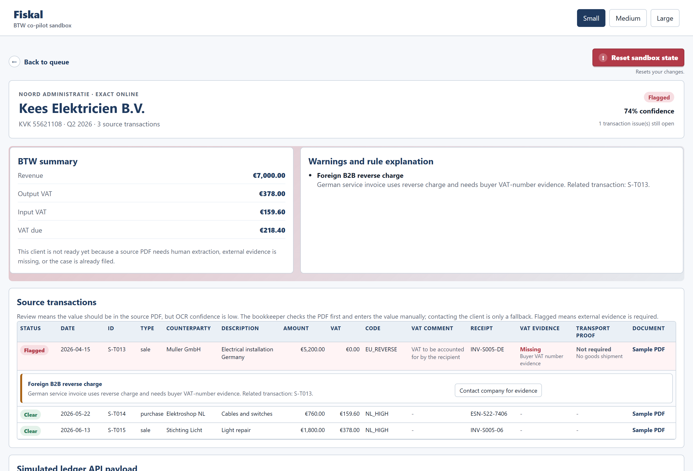

# Fiskal VAT Review Sandbox


Live demo: [https://fiskal-app.happycliff-ffe64e1f.swedencentral.azurecontainerapps.io](https://fiskal-app.happycliff-ffe64e1f.swedencentral.azurecontainerapps.io)

Fiskal is a sandbox MVP for a Dutch bookkeeping-office VAT review co-pilot. It helps a bookkeeper inspect quarterly BTW work before filing by combining sample ledger exports, generated source PDFs, deterministic VAT checks, human review flows, and a simulated ledger write-back payload.

The app is intentionally not connected to real customers, ledgers, banks, SBR, Digipoort, or tax-filing systems.

## Topic Tags

`fintech` `vat` `btw` `bookkeeping` `flask` `docker` `azure-container-apps` `bicep` `playwright` `ai-agents` `github-copilot` `csv-data` `dutch-tax` `sandbox`

## Screenshots

**Office review queue** — one view of every client's readiness, with VAT totals, statuses, confidence, and the warning behind each row.



**Client detail** — the VAT summary, the row-level rule explanation, and the evidence/review actions behind a flagged client.



## Contents

- [Requirements](#requirements)
- [Install And Run](#install-and-run)
- [Configuration](#configuration)
- [Run Tests](#run-tests)
- [Run With Docker](#run-with-docker)
- [Deploy To Azure](#deploy-to-azure)
- [Core Workflow](#core-workflow)
- [Status Meaning](#status-meaning)
- [Rule Engine](#rule-engine)
- [HTTP Endpoints](#http-endpoints)
- [Sample Data](#sample-data)
- [Generated PDFs](#generated-pdfs)
- [Security And Limitations](#security-and-limitations)
- [Project Structure](#project-structure)
- [Agent Orchestration](#agent-orchestration)

## Requirements

- Python `3.12` (`3.12.7` was used for development and testing)
- Node.js `20+` for Playwright browser tests
- Docker Desktop for container runs
- Azure CLI for Azure deployment

## Install And Run

Run these commands from the repository root.

### Windows PowerShell

```powershell
python --version
python -m venv .venv
.\.venv\Scripts\Activate.ps1
python -m pip install --upgrade pip
python -m pip install -r requirements.txt
python app.py
```

### macOS Or Linux

```bash
python3.12 --version
python3.12 -m venv .venv
source .venv/bin/activate
python -m pip install --upgrade pip
python -m pip install -r requirements.txt
python app.py
```

Open `http://localhost:8000`.

## Configuration

The app reads a few optional environment variables. Defaults are tuned for a local sandbox run, so none are required to start.

| Variable | Default | Purpose |
| --- | --- | --- |
| `PORT` | `8000` | Port the Flask server listens on. |
| `FLASK_SECRET_KEY` | `fiskal-demo-secret-key` | Signs the session cookie that stores approvals, corrections, and evidence. **Set a strong random value before any non-local use.** |
| `FLASK_DEBUG` | `0` | Set to `1` to enable the Flask debugger and auto-reload. Keep it `0` outside local development. |

Example (Windows PowerShell):

```powershell
$env:FLASK_SECRET_KEY = "replace-with-a-long-random-string"
$env:PORT = "8000"
python app.py
```

## Run Tests

Python tests:

```powershell
python --version
python -m pytest tests
```

Browser tests:

```powershell
npm ci
npx playwright install chromium
npm run test:e2e
```

The Playwright tests simulate real browser clicks through the review queue, client detail pages, evidence flow, manual review flow, approval flow, and payload preview. They were used to automatically verify agent-made UI and workflow changes.

## Run With Docker

```powershell
docker build -t fiskal-vat-review .
docker run --rm -p 8000:8000 fiskal-vat-review
```

Open `http://localhost:8000`.

## Deploy To Azure

The Bicep template in `infra/main.bicep` deploys the app to Azure Container Apps. It creates:

- Azure Container Registry
- Log Analytics workspace
- Container Apps managed environment
- Public Container App with `/healthz` probes

Deploy from the repository root:

```powershell
az login
.\infra\deploy.ps1 -ResourceGroup rg-AgentExperiment -Location swedencentral -AppName fiskal -ImageTag latest
```

Manual Azure commands are documented in `infra/README.md`.

## Core Workflow

1. Load CSV exports from Moneybird, Exact Online, Twinfield, and SnelStart sample ledgers.
2. Group transactions by client and quarter.
3. Apply deterministic VAT review rules.
4. Assign each client one public status: `Ready`, `Review`, `Flagged`, or `Filed`.
5. Show the source transaction rows and generated source PDFs behind each warning.
6. Let the bookkeeper enter missing receipt values or request evidence.
7. Move resolved clients to `Ready`.
8. Approve and file ready clients inside the sandbox.
9. Preview the simulated ledger payload. No external API call is made.

## Status Meaning

- `Ready`: no open warnings that need a human check.
- `Review`: the value should exist in the source PDF, but OCR/manual extraction needs a human check.
- `Flagged`: external evidence or compliance proof is missing.
- `Filed`: the CSV says the client was already filed, or the bookkeeper approved and filed it in the sandbox.

## Rule Engine

- Heuristic and explainable.
- Not machine learning.
- Uses fixed warning penalties and a small deterministic client-ID adjustment.
- Keeps final approval with the bookkeeper.

## HTTP Endpoints

All state lives in the signed session cookie; there is no database. The main routes are:

| Method | Route | Purpose |
| --- | --- | --- |
| `GET` | `/` | Office review queue with status, ledger, and search filters. |
| `GET` | `/client/<profile>/<client_id>` | Client detail: VAT summary, warnings, transactions, and payload preview. |
| `GET` | `/healthz` | Liveness probe used by Docker and Azure. |
| `POST` | `/approve` | Approve and file the selected `Ready` clients in the sandbox. |
| `POST` | `/correct-transaction` | Enter a missing receipt value read from the source PDF. |
| `POST` | `/request-review-help` / `/use-review-reply` | Simulate contacting the client for an unreadable value, then apply the reply. |
| `POST` | `/request-evidence` / `/analyse-evidence` | Request and then accept the simulated compliance evidence PDF. |
| `POST` | `/reset` | Clear all sandbox session state. |
| `GET` | `/api/payload/<profile>/<client_id>` | JSON preview of the simulated ledger write-back payload. |
| `GET` | `/sample-document/<profile>/<transaction_id>.pdf` | Generated source invoice or receipt PDF. |
| `GET` | `/evidence-document/<profile>/<transaction_id>.pdf` | Generated evidence PDF. |

## Sample Data

The repository includes three bookkeeping-office profiles:

- `data/profiles/small/`
- `data/profiles/medium/`
- `data/profiles/large/`

Each profile contains:

| File | Purpose |
| --- | --- |
| `office.csv` | Bookkeeping office profile |
| `clients.csv` | Client accounts |
| `transactions.csv` | Ledger rows |
| `exceptions.csv` | Flagged evidence signals |

Included edge cases:

- Hard-to-read handwritten receipt IDs
- Reverse-charge service rows
- Intra-EU goods rows needing transport proof
- Missing buyer VAT-number evidence
- Unknown VAT-code rows
- Clients that are already filed in source data

## Generated PDFs

Fiskal generates local sample PDFs for source invoices, receipts, and evidence documents. These PDFs are generated from sample data and do not contain real customer documents.

The test suite includes a PyMuPDF layout check that verifies generated PDF text stays inside the page and that money columns do not overlap.

## Security And Limitations

This is a sandbox MVP, and several properties are deliberate:

- **No real data.** All ledgers, clients, transactions, and documents are generated sample data. The repository contains no real customer records, API credentials, or production secrets.
- **No external calls.** Approving a client only builds and previews a payload. No request is made to any ledger, bank, SBR, or Digipoort endpoint.
- **Session-only state.** Approvals, corrections, and evidence live in the signed Flask session cookie and reset when the session ends or via `/reset`. There is no database and no multi-user persistence.
- **The score is a guide, not advice.** The confidence score prioritises review work; it is not tax advice, and final approval always stays with the bookkeeper.

Before any non-sandbox use, the following are required:

- Set a strong random `FLASK_SECRET_KEY` and run behind HTTPS so the session cookie cannot be forged.
- Add authentication and per-office access control; today every visitor shares the same sandbox session.
- Replace sample data and the simulated payload with real, authenticated ledger and tax-filing integrations.

## Project Structure

```text
app.py                  Flask routes and session workflow
fiskal/data_loader.py   CSV loading and normalization
fiskal/rules.py         Deterministic VAT review rules
fiskal/payloads.py      Simulated ledger payload builder
fiskal/sample_pdf.py    Generated sample/evidence PDF renderer
templates/              Dashboard and client-detail HTML
static/                 CSS
data/profiles/          Small, medium, and large sample datasets
tests/                  Python and Playwright regression tests
infra/                  Azure Bicep deployment files
```

## Agent Orchestration

Public-safe agent workflow notes are documented in `AGENTS.md` and `.agents/README.md`. Project-specific GitHub Copilot guidance is documented in `.github/copilot-instructions.md`.

The repository also includes the public Playwright CLI skill reference at `.agents/skills/playwright-cli/SKILL.md`. That skill documents the browser-automation workflow used around Playwright-assisted testing; the repeatable regression command remains `npm run test:e2e`.

No private prompts, chat transcripts, local credentials, generated caches, or test output folders are part of the repository.
